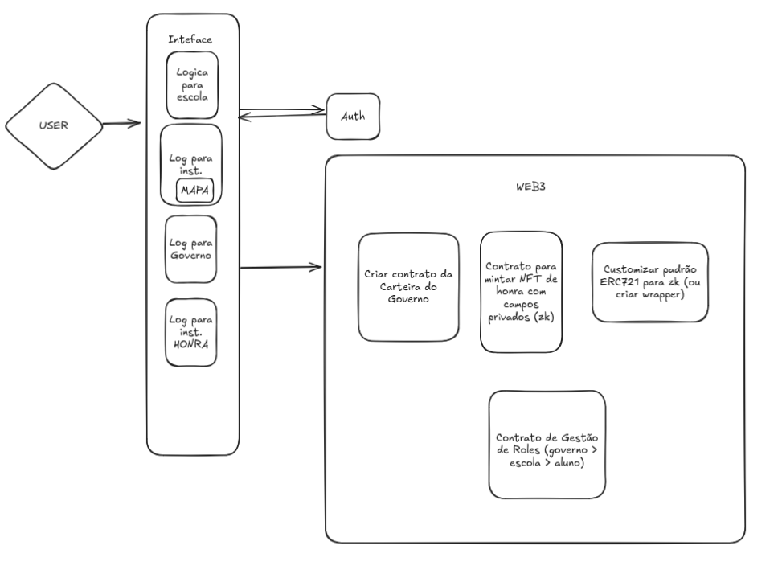

# EduWallet

## Visão Geral

EduWallet é uma plataforma descentralizada criada para identificar, reconhecer e conectar talentos estudantis no Brasil com oportunidades educacionais, profissionais e institucionais. Utilizando tecnologia blockchain e provas de conhecimento zero (ZKP), o sistema permite que instituições educativas e de mérito emitam certificados imutáveis e privados (NFTs) para alunos com desempenhos de destaque, promovendo inclusão e privacidade.

## Modelo de Negócios

EduWallet funciona como infraestrutura digital para um ecossistema de talentos, onde diferentes atores (governos, escolas, instituições de mérito e de oportunidade) interagem em torno do reconhecimento estudantil.

* B2G (Business to Government): governos estaduais/municipais usam EduWallet para mapear talentos regionais.
* B2I (Business to Institution): instituições como OBMEP, OBA, Ismart e Instituto Ponte utilizam a plataforma para emitir NFTs de mérito.
* B2S (Business to Student): alunos usam a EduWallet para gerenciar seu histórico de conquistas de forma segura e verificável.
* Monetização: subsídios governamentais, licenças para instituições, e integração com APIs de oportunidades (bolsas, programas).

## Impacto Social

* Democratiza o acesso às oportunidades educacionais.
* Reduz barreiras de reconhecimento de talentos de baixa renda.
* Preserva a privacidade dos estudantes via provas zk.
* Promove transparência e equidade na distribuição de oportunidades.

## Personas e Atores

* Governo:

  * Cadastra escolas públicas e privadas.
  * Visualiza mapa de talentos por região.

* Escola:

  * Registra alunos e gerencia carteiras.
  * Acompanha histórico de méritos da instituição.

* Instituição de Mérito (ex: OBMEP, OBA):

  * Emite NFTs com provas zk de mérito.
  * Garante autenticidade sem expor dados sensíveis.

* Aluno:

  * Recebe NFT em sua carteira.
  * Apresenta apenas o número total de conquistas.

* Instituição de Oportunidade (ex: Ismart):

  * Consulta carteira de méritos anonimizados.
  * Convida estudantes para seleções e bolsas.

## Arquitetura da Solução

### Módulos Principais

1. Identidade e Governança:

   * Contratos para cadastro de escolas e alunos.
   * Gerenciamento de permissões via RBAC.

2. Certificação Privada:

   * NFTs com metadados de mérito criptografados.
   * zk-SNARKs para validação da autenticidade sem revelar conteúdo.

3. Visualização e Oportunidades:

   * Aluno compartilha quantidades de méritos, não conteúdo.
   * API para instituições visualizarem talentos.
   
 

Figura X - Arquitetura da Solução
 
 

 
 
Fonte: Material produzido pelos autores (2025)

 

### Tecnologias

* Solidity (Contratos inteligentes)
* zk-SNARK (Circom/SnarkJS)
* ERC721 customizado
* Next.js + Tailwind (Frontend)
* IPFS (opcional para metadados off-chain)

## Considerações Finais

EduWallet posiciona-se como uma solução inovadora de impacto social real, ao utilizar tecnologias de ponta para resolver um problema estrutural: a falta de visibilidade e reconhecimento de talentos da educação pública brasileira.
